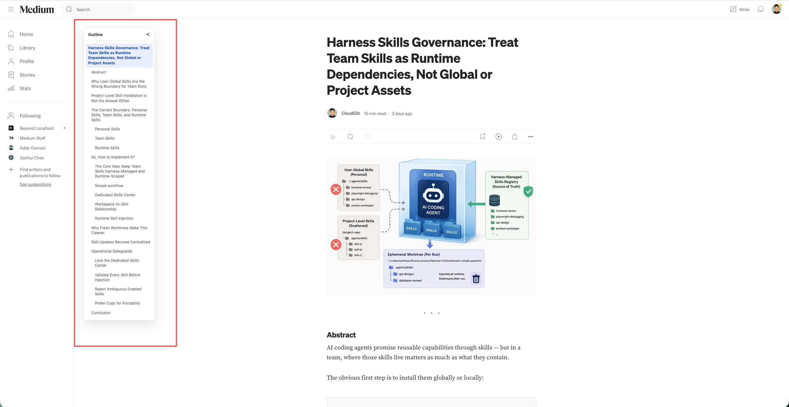

# Medium Article Outline

A lightweight Chrome extension that adds a left-hand outline sidebar to Medium articles.

## Features

  

- Builds an article outline from visible `h1` through `h4` headings.
- Runs only on Medium article/story pages, not Medium library, profile, topic, or listing pages.
- Positions the outline to the right of Medium's existing left sidebar when present.
- Supports Medium-powered publication domains such as `*.medium.com` and custom Medium domains.
- Highlights the current section while scrolling.
- Smooth-scrolls to a section when an outline item is clicked.
- Rebuilds automatically when Medium changes article content without a full page load.
- Hides itself on narrow screens and on pages without enough headings.

## Load Locally

1. Open `chrome://extensions`.
2. Enable **Developer mode**.
3. Click **Load unpacked**.
4. Select this folder: `/Users/clouds3n/Coding/open-source/chrome-extensions/medium-outline-chrome-extension`.
5. Open a Medium article such as `https://medium.com/...`.

## Files

- `manifest.json`: Chrome Manifest V3 configuration.
- `src/content.js`: Medium heading detection, sidebar rendering, scroll tracking, and dynamic rebuilds.
- `src/styles.css`: Isolated sidebar styles.
